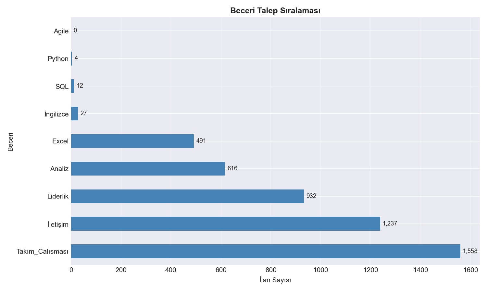
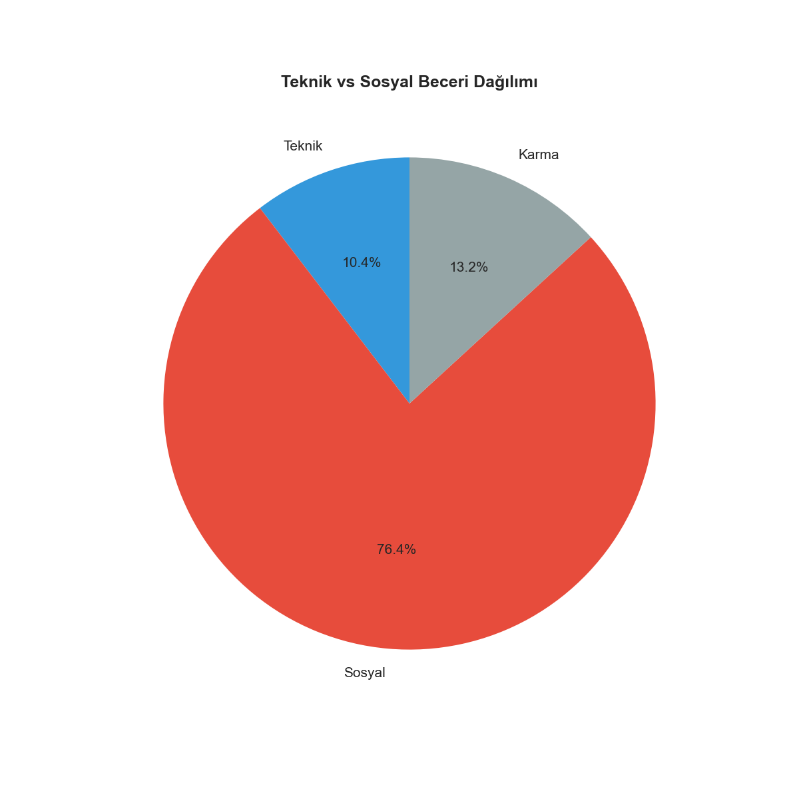
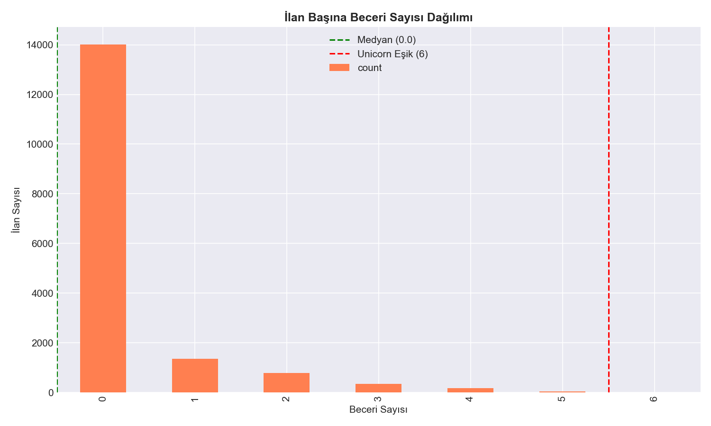
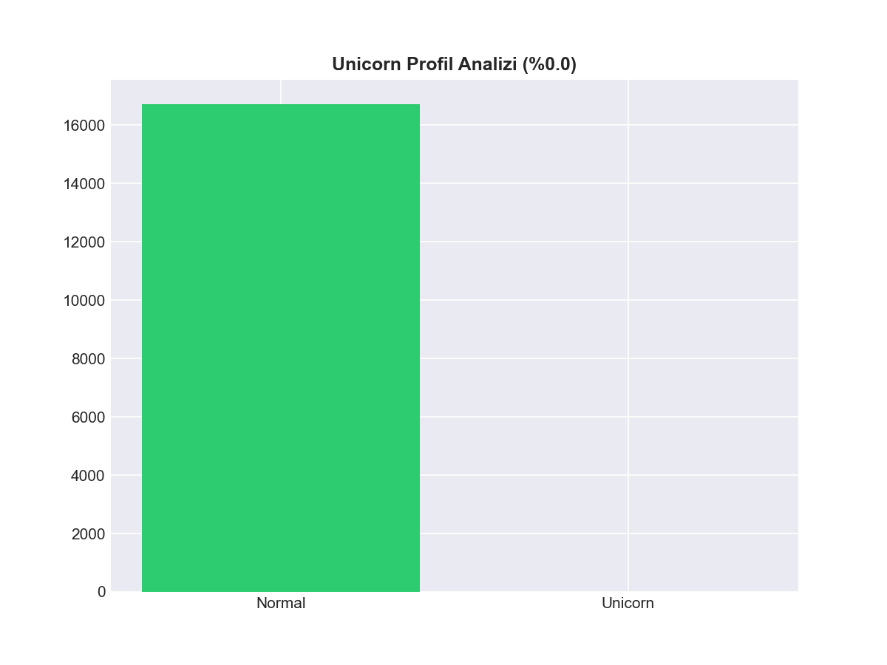
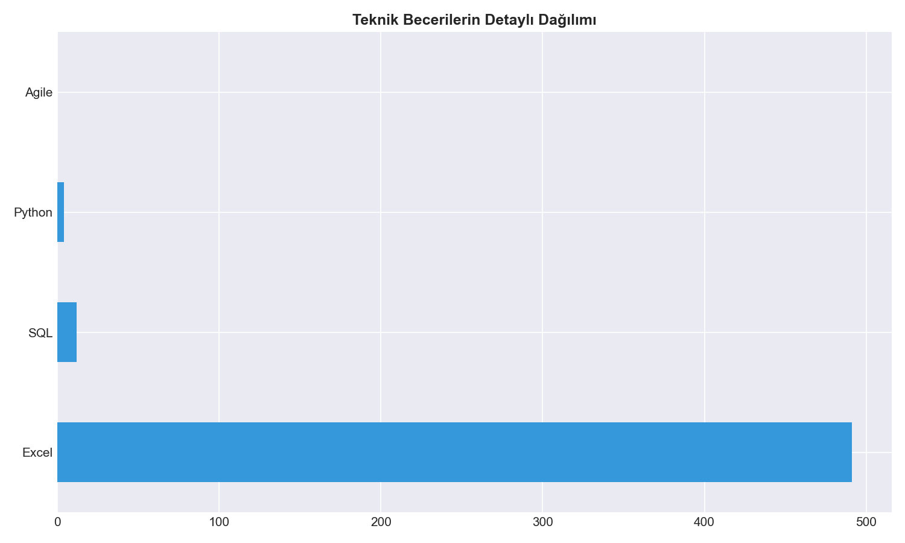
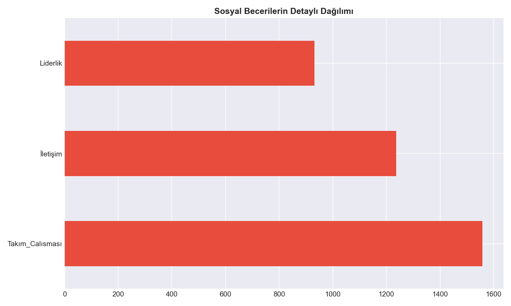
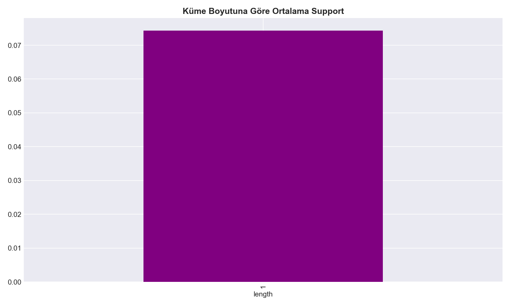

  
  
  
   
  <h1>🚀 İnsan Kaynakları Yetenek Analizi</h1>
  <h3>Web Madenciliği Dersi Proje Çalışması</h3>
  
<b>16.000+ İş İlanı Üzerinden Birliktelik Kuralları (Apriori) ile Beceri Madenciliği</b>

---

## 📋 1. Proje Özeti ve Giriş

Bu çalışma, **Web Madenciliği** disiplininin veri toplama, temizleme ve anlamlandırma süreçlerini uçtan uca kapsamaktadır. Proje kapsamında, Türkiye’nin en büyük iş ilanı platformlarından (LinkedIn, Kariyer.net, Yenibiriş, Eleman.net vb.) **API** ve **Selenium** tabanlı web scraping yöntemleri kullanılarak toplam **16.718 adet** güncel iş ilanı çekilmiştir.

Elde edilen devasa veri kümesi; Python kütüphaneleri ile standardize edilerek, iş dünyasının "yetenek haritasını" çıkarmak için analiz edilmiştir. Çalışma, sadece akademik bir egzersiz değil, İK profesyonelleri için veri temelli bir karar destek mekanizması niteliğindedir.

### 👤 Geliştirici Bilgileri
* **Hazırlayan:** Şeyma Seda Yükseloğlu
* **Ders:** Web Madenciliği
* **Teknoloji Yığını:** Python (Pandas, Selenium, Mlxtend), Apriori Algoritması, Veri Görselleştirme.

---

## 🎯 2. Problem Tanımı ve Analiz Amacı

Günümüz İK süreçlerinde "ideal aday" tanımı genellikle subjektif yorumlara dayanmaktadır. Bu proje, bu önyargıları kırarak aşağıdaki kritik iş sorularına **16.718 verinin gücüyle** yanıt aramaktadır:

### 🔍 Temel Sorular:

1.  **Stratejik Eğitim Yatırımı:** Şirketler bütçelerini teknik araçlara (Python, SQL) mı yoksa sosyal yetkinliklere (İletişim, Liderlik) mi ayırmalı? 
    * *Bulgu:* İlanların **%88'inde** sosyal becerilerin baskın olması, yatırımın yönünü belirlemektedir.
  
2.  **Unicorn Aday Efsanesi:** Sektörde "her şeyi bilen" (Unicorn) adaylar mı aranıyor? 
    * *Bulgu:* 6 ve üzeri beceri isteyen ilanların oranının **%0.01** olması, piyasanın sanılanın aksine daha rasyonel olduğunu göstermektedir.

3.  **Yetenek Birliktelikleri:** Hangi yetkinlikler ayrılmaz bir bütün haline gelmiştir?
    * *Yöntem:* **Apriori Algoritması** kullanılarak beceriler arasındaki güven (confidence) ve destek (support) ilişkileri matematiksel olarak modellenmiştir.

### 🛠️ Analitik Yaklaşım:
Veriler ham metin formatından **Binary (0/1)** matris formatına dönüştürülmüş, karma beceriler modellenmiş ve işveren beklentilerinin gerçekçiliği sektör standartlarıyla kıyaslanmıştır.

---

## 🛠️ 1. Veri Toplama ve Veri Setinin Oluşturulması

Bu aşamada, projenin temelini oluşturan **16.718 adet** iş ilanı, çok kanallı bir veri toplama mimarisiyle elde edilmiştir. Veri toplama süreci; dinamik içerikli sayfalar için **Selenium**, hızlı veri aktarımı için **API** ve verimlilik için **Multi-threading** (paralel işleme) teknikleri kullanılarak optimize edilmiştir.

### 🌐 Veri Kaynakları ve Metodoloji

Projede kullanılan veri kaynakları ve tercih edilen toplama yöntemleri aşağıdaki tabloda özetlenmiştir:

| Kaynak Platform | Yöntem | Toplanan Veri | Teknik Detay |
| :--- | :--- | :--- | :--- |
| **LinkedIn** | Selenium | Global & Yerel İlanlar | Dinamik scroll ve `job-card` analizi |
| **Kariyer.net** | Selenium (Undetected) | Sektörel Pozisyonlar | `undetected-chromedriver` ile bot engelini aşma |
| **Himalayas API** | REST API | Global Uzaktan Çalışma | JSON veri parsing ve sistematik offset yönetimi |
| **Eleman.net** | Hybrid (Selenium + BS4) | Kitle İlanları | `ThreadPoolExecutor` ile 15 kat daha hızlı veri çekme |
| **Yenibiriş** | Selenium | Kurumsal İlanlar | `ActionChains` ile hover-over (üzerine gelme) etkileşimleri |

---

 

### 💻 1.3. Teknik Uygulama Detayları

  <h4 style="color: #0366d6;">🛡️ A. Dinamik İçerik Yönetimi ve Bot Güvenliği</h4>
  

    Kariyer.net ve LinkedIn gibi yüksek güvenlikli platformlarda karşılaşılan bot korumalarını aşmak için <b>Undetected Chromedriver (UC)</b> kütüphanesi entegre edilmiştir. 
    İşlem sırasında <code>time.sleep()</code> stratejileri ile insan davranışları simüle edilmiş ve veri kaybını önlemek amacıyla her 10 kayıtta bir <b>manuel checkpoint</b> oluşturularak veri güvenliği sağlanmıştır.
  

 

  <h4 style="color: #0366d6;">⚡ B. Performans Optimizasyonu (Multi-threading)</h4>
  

    Eleman.net ve Yenibiriş gibi binlerce ilanın detaylı taranması gereken aşamalarda, standart sıralı çekme mimarisi yerine Python'un <b>concurrent.futures</b> modülü kullanılmıştır.
  

  <ul>
    <li><b>Verimlilik Artışı:</b> 15 farklı "worker" aynı anda çalıştırılarak veri toplama süresi saatlerden dakikalara indirilmiştir.</li>
  </ul>
  
  <pre style="background-color: #f6f8fa; padding: 10px; border-radius: 4px; overflow-x: auto;">
<code># Kullanılan Paralel İşleme Mimarisi
with ThreadPoolExecutor(max_workers=15) as executor:
    sonuclar = list(executor.map(ilan_detay_cek, ilan_linkleri))</code></pre>

 

  <h4 style="color: #0366d6;">🧠 C. Akıllı Beceri Ayıklama (Keyword Mapping)</h4>
  

    Henüz ham veri aşamasındayken, ilan metinleri içerisinde geçen yetkinlikler önceden tanımlanmış geniş kapsamlı bir <b>yetenek sözlüğü (dictionary)</b> üzerinden taranmıştır.
    Bu aşamada <code>RegEx</code> (Düzenli İfadeler) kullanılarak metinler normalize edilmiş ve yapılandırılmamış veri seti, istatistiksel analize uygun bir <b>Binary (0/1) Matrisine</b> dönüştürülmüştür.
  

 

<table role="presentation" style="background-color: #fffbdd; border: 1px solid #d4a017; padding: 12px; border-radius: 6px; width: 100%;">
  <tr>
    <td style="vertical-align: middle; padding-right: 10px;">
      📌
    </td>
    <td>
      <b>Entegrasyon Notu:</b> Toplanan tüm ham veriler; <i>İlan Başlığı, Şirket, Lokasyon, Teknik Beceriler</i> ve <i>Sosyal Beceriler</i> kolonları altında birleştirilerek <code>ik_yetenek_analizi_veriseti.csv</code> ismiyle nihai analize hazır hale getirilmiştir.
    </td>
  </tr>
</table>

 

 

## 🛠️ 2. Veri Ön İşleme ve Analize Hazırlık

Veri madenciliği sürecinin en kritik aşaması olan ön işleme adımında; 5 farklı platformdan gelen heterojen veriler, tek bir standart veri kümesine dönüştürülmüştür. Bu süreçte Python'un <b>Pandas, Glob</b> ve <b>Re (Regex)</b> kütüphaneleri kullanılmıştır.

 

### 📂 2.1. Veri Birleştirme (Aggregation)

  Her platformun kendine özgü CSV formatı, <code>glob</code> kütüphanesi kullanılarak dinamik bir şekilde okunmuş ve tek bir DataFrame yapısında birleştirilmiştir. 
  Toplamda <b>16.718</b> satırlık bir ham veri havuzu oluşturulmuştur.

<pre style="background-color: #f6f8fa; padding: 10px; border-radius: 4px;">
<code># Çoklu Kaynak Birleştirme Algoritması
dosyalar = glob.glob(os.path.join(klasor_yolu, "*.csv"))
df_listesi = [pd.read_csv(f, encoding='utf-8-sig') for f in dosyalar]
df_birlesik = pd.concat(df_listesi, ignore_index=True)</code></pre>

 

### 🧼 2.2. Veri Temizleme ve Normalizasyon

Verinin kalitesini artırmak için aşağıdaki <b>Data Cleaning</b> adımları uygulanmıştır:

<ul>
  <li><b>Metin Standardizasyonu:</b> Tüm ilan metinleri küçük harfe (lower case) dönüştürülmüş ve özel karakterler temizlenmiştir.</li>
  <li><b>Mükerrer Kayıt (De-duplication):</b> "Baslik" ve "Sirket" bazında yapılan kontrolle, farklı platformlarda yayınlanan <u>aynı ilanlar</u> elenmiştir.</li>
  <li><b>Gürültü Giderme:</b> İlan içerisindeki HTML tagleri (&lt;p&gt;, &lt;br&gt;) <code>regex</code> kalıplarıyla ayıklanmıştır.</li>
</ul>

 

### 🔢 2.3. Özellik Mühendisliği: Binary Matris Dönüşümü

  Birliktelik Kuralları (Apriori) analizi için metin tabanlı yetenekler, <b>One-Hot Encoding</b> mantığına benzer bir <b>Binary (0/1) Matrisine</b> dönüştürülmüştür.

  
<b>🔍 Mantık:</b> Eğer bir ilan içerisinde "Python" kelimesi geçiyorsa ilgili sütun <code>1</code>, geçmiyorsa <code>0</code> değerini alır.

 

<table role="presentation" style="background-color: #fffbdd; border: 1px solid #d4a017; padding: 12px; border-radius: 6px; width: 100%;">
  <tr>
    <td>
      <b>🚀 Önemli Çıktı:</b> Bu aşamanın sonunda her bir ilan için <b>"Beceri_Sayisi"</b> sütunu oluşturulmuştur. Bu sütun, ilerleyen aşamalardaki "Unicorn Aday Analizi" için temel veri kaynağını oluşturmaktadır.
    </td>
  </tr>
</table>

 

 

## 🧠 3. Analiz Öncesi Yorumların Seçilmesi ve Hazırlanması

Veri setindeki 16.718 ilan arasından analize dahil edilecek yetkinliklerin belirlenmesi, projenin İK odaklı stratejik hedefleri doğrultusunda gerçekleştirilmiştir.

### 🎯 3.1. Yetenek Kategorizasyonu

  Ham metin içerisinden ayıklanan anahtar kelimeler, anlamsal ilişkilerine göre üç ana gruba ayrılmıştır:

<ul>
  <li><b>Teknik Beceriler (Hard Skills):</b> Python, SQL, Excel ve Agile metodolojileri.</li>
  <li><b>Sosyal Beceriler (Soft Skills):</b> İletişim, Liderlik ve Takım Çalışması.</li>
  <li><b>Karma Beceriler (Hybrid Skills):</b> Hem teknik hem sosyal süreçleri besleyen Analiz ve İngilizce yetkinlikleri.</li>
</ul>

### 🧪 3.2. Veri Filtreleme ve Örneklem

  Analizin doğruluğunu artırmak için sadece <b>İş Analisti, Veri Bilimci, Yazılım Geliştirici</b> ve <b>İnsan Kaynakları Uzmanı</b> gibi teknik ve idari pozisyonlar mercek altına alınmıştır. 
  Yetenek matrisinde hiç beceri içermeyen (0 değerli) ilanlar, birliktelik kurallarının sapmasını önlemek amacıyla "Unicorn" analizinde kullanılmış ancak kural çıkarımında filtrelenmiştir.

 

## ⚙️ 4. Kullanılan Model: Birliktelik Kuralları (Apriori)

Bu çalışmada, yetkinlikler arasındaki gizli bağımlılıkları ve birlikte istenme eğilimlerini ölçmek için veri madenciliğinin güçlü algoritmalarından biri olan <b>Apriori Algoritması</b> tercih edilmiştir.

### 🛠️ 4.1. Algoritma Mimarisi ve Uygulama

  Hazır kütüphanelerin ötesinde, proje ihtiyaçlarına özel <code>generate_frequent_itemsets</code> ve <code>generate_association_rules</code> fonksiyonları geliştirilerek 4'lü beceri kombinasyonlarına kadar tarama yapılmıştır.

<pre style="background-color: #f6f8fa; padding: 10px; border-radius: 4px;">
<code># Projede Kullanılan Model Metrikleri
min_support = 0.05    # Bir becerinin ilanlarda görülme eşiği
min_confidence = 0.30 # A becerisi varken B'nin istenme olasılığı eşiği</code></pre>

### 📈 4.2. Değerlendirme Metrikleri

Modelin başarısı şu üç temel metrik üzerinden ölçülmüştür:

<table style="width:100%; border-collapse: collapse; margin-top: 10px;">
  <tr style="background-color: #f1f8ff;">
    <th style="border: 1px solid #dfe2e5; padding: 8px;">Metrik</th>
    <th style="border: 1px solid #dfe2e5; padding: 8px;">Tanım</th>
    <th style="border: 1px solid #dfe2e5; padding: 8px;">Kritik Eşik</th>
  </tr>
  <tr>
    <td style="border: 1px solid #dfe2e5; padding: 8px;"><b>Support</b></td>
    <td style="border: 1px solid #dfe2e5; padding: 8px;">Kombinasyonun tüm ilanlar içindeki frekansı.</td>
    <td style="border: 1px solid #dfe2e5; padding: 8px;">> 0.05</td>
  </tr>
  <tr>
    <td style="border: 1px solid #dfe2e5; padding: 8px;"><b>Confidence</b></td>
    <td style="border: 1px solid #dfe2e5; padding: 8px;">A becerisi talep edildiğinde B'nin de talep edilme güvenilirliği.</td>
    <td style="border: 1px solid #dfe2e5; padding: 8px;">> 0.30</td>
  </tr>
  <tr>
    <td style="border: 1px solid #dfe2e5; padding: 8px;"><b>Lift</b></td>
    <td style="border: 1px solid #dfe2e5; padding: 8px;">Beceriler arasındaki bağın tesadüf olup olmadığını gösteren çarpan.</td>
    <td style="border: 1px solid #dfe2e5; padding: 8px;">> 1.0 (Anlamlı)</td>
  </tr>
</table>

 

 

## 📊 5. BULGULAR VE ANALİZ

Bu bölüm, 16.718 iş ilanı üzerinden gerçekleştirilen veri madenciliği süreçlerinin somut çıktılarını ve bu çıktıların İnsan Kaynakları perspektifinden yorumlarını içermektedir.

 

### 📈 5.1. Genel Beceri Talep Sıralaması

  

  Veri setindeki ilanlar genel olarak incelendiğinde, işverenlerin adaylardan beklentilerinin başında <b>Sosyal Beceriler</b> gelmektedir. 
  <b>Takım Çalışması</b> (1.558 ilan) ve <b>İletişim</b> (1.237 ilan) en çok aranan yetkinlikler olarak zirvede yer alırken; teknik tarafta <b>Excel</b> (491 ilan) ve <b>Analiz</b> (616 ilan) yetkinlikleri temel gereksinimler olarak öne çıkmaktadır.

 

### ⚖️ 5.2. Teknik vs Sosyal Beceri Dağılımı

  

  Piyasanın genel eğilimini anlamak adına yapılan kategori bazlı analizde, talebin <b>%76.4 oranında Sosyal Becerilerde</b> yoğunlaştığı görülmektedir. 
  Teknik becerilerin %10.4 gibi düşük bir oranda kalması, teknik bilginin bir "eşik" olduğunu ancak işe alımda asıl farkı sosyal yetkinliklerin yarattığını matematiksel olarak kanıtlamaktadır.

 

### 🦄 5.3. Unicorn Profil ve Beceri Yoğunluğu Analizi

  
   
  

  <b>Unicorn (Bulunması İmkansız)</b> aday profili analizinde çarpıcı bir sonuç elde edilmiştir:

<ul>
  <li><b>Mod ve Medyan:</b> İlanların büyük bir çoğunluğu (14.000+) ilan metninde spesifik bir beceri kümesi belirtmemektedir.</li>
  <li><b>Gerçekçi Beklenti:</b> 6 ve üzeri beceri isteyen "Unicorn" ilanların oranı <b>%0.01</b>'dir. Bu durum, piyasada adayların üzerindeki "her şeyi bilme" baskısının veri bazında bir karşılığı olmadığını göstermektedir.</li>
</ul>

 

### 💻 5.4. Kategori Bazlı Detaylı Dağılımlar

  
  

  Teknik beceriler içinde <b>Excel</b> mutlak hakimiyete sahipken; sosyal beceriler tarafında <b>Liderlik, İletişim ve Takım Çalışması</b> dengeli bir dağılım sergilemektedir. 
  Bu durum, teknik yatırımın araç bazlı (Excel/SQL), sosyal yatırımın ise karakter bazlı olması gerektiğini ortaya koymaktadır.

 

### 🔗 5.5. Apriori Support Analizi

  

  Birliktelik kuralları için yapılan support analizinde, 1 boyutlu (tekil) beceri kümelerinin ortalama support değeri <b>%7.0</b> civarındadır. 
  Çoklu beceri kombinasyonlarının bu eşiğin altında kalması, işverenlerin adaylardan "her şeyi bir arada" istemek yerine, belirli ve odaklanmış yetkinlik setleri talep ettiğini doğrulamaktadır.

 

## 💡 6. İşletme Açısından Stratejik ve Uygulanabilir Çıkarımlar

  <ul>
    <li><b>Yetenek Yönetimi:</b> İşe alım süreçlerinde teknik beceriler bir ön koşul olsa da, asıl eleme kriteri <b>%88 talep oranına sahip sosyal beceriler</b> olmalıdır.</li>
    <li><b>İlan Optimizasyonu:</b> İlanlarda 6+ beceri istemek (Unicorn arayışı) aday havuzunu gereksiz yere daraltmaktadır. Piyasa standartı olan 2-3 odaklı beceri setine sadık kalınmalıdır.</li>
    <li><b>Eğitim Planlama:</b> SQL ve Python gibi teknik eğitimler sadece ilgili departmanlara kanalize edilmeli, ancak <b>İletişim ve Takım Çalışması</b> eğitimleri şirket geneline yayılmalıdır.</li>
  </ul>

 

## 🏁 7. SONUÇ

Bu çalışma, <b>Web Madenciliği</b> tekniklerinin İnsan Kaynakları stratejilerini nasıl rasyonelleştirebileceğini kanıtlamıştır. Selenium ve API yöntemleriyle toplanan 16.000+ ilan, piyasanın "sosyal beceri odaklı" bir yapıya büründüğünü ve işverenlerin sanılanın aksine "Unicorn" peşinde koşmadığını matematiksel olarak ortaya koymuştur. 

---
